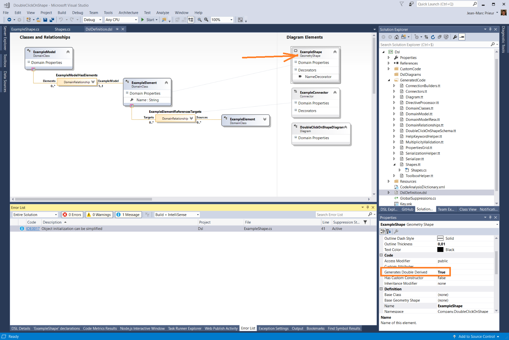
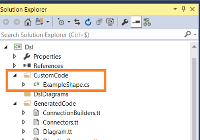

## Goal
This DSL Tools sample shows how to let the end user double-click on a text decorator in a shape and trigger an editor of the developer's choice to edit this textual value

## How to proceed
starting from the default DSL, which create an **ExampleElement** represented by an **ExampleShape**, you will need to:
1.	set the **Generate Double Derived** property of the **ExampleShape** to True, and build the solution once.

2.	Create a project folder named Custom Code under the DSL project, and add a file named ExampleShape.cs

3. Override the InitializeShapeFields method of ExampleShape so that it:
- calls the base class implementation [here](https://github.com/jmprieur/DslToolsSamples/blob/master/DoubleClickOnShape/Dsl/CustomCode/ExampleShape.cs#L57)

- remove the "NameDecorator" which was created by the generated code [here](https://github.com/jmprieur/DslToolsSamples/blob/master/DoubleClickOnShape/Dsl/CustomCode/ExampleShape.cs#L60)

- [Re-add](https://github.com/jmprieur/DslToolsSamples/blob/master/DoubleClickOnShape/Dsl/CustomCode/ExampleShape.cs#L64) the name decorator but instanciating a class CustomTextFieldWithEditorOnDoubleClick inheriting from TextField but [overrinding](https://github.com/jmprieur/DslToolsSamples/blob/master/DoubleClickOnShape/Dsl/CustomCode/ExampleShape.cs#L28-L33) 
  the OnDoubleClick method in order to present a custome editor.
  
 The CustomTextFieldWithEditorOnDoubleClick class also needs to override the [CanEditValue](https://github.com/jmprieur/DslToolsSamples/blob/master/DoubleClickOnShape/Dsl/CustomCode/ExampleShape.cs#L42) method to disable direct editing of the text field
